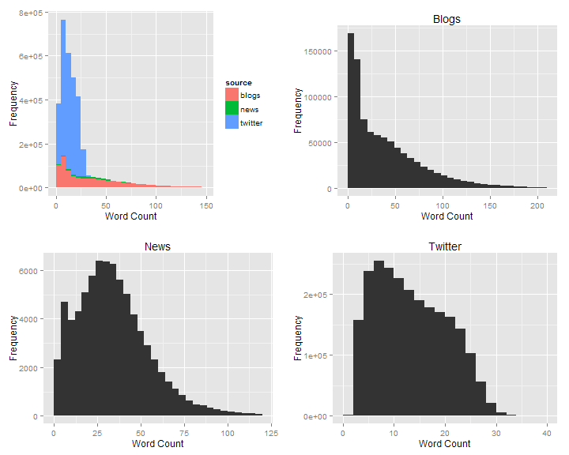
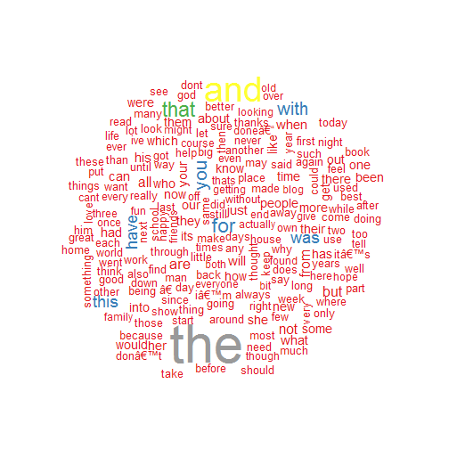
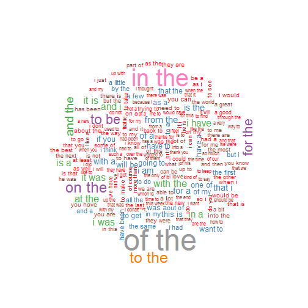
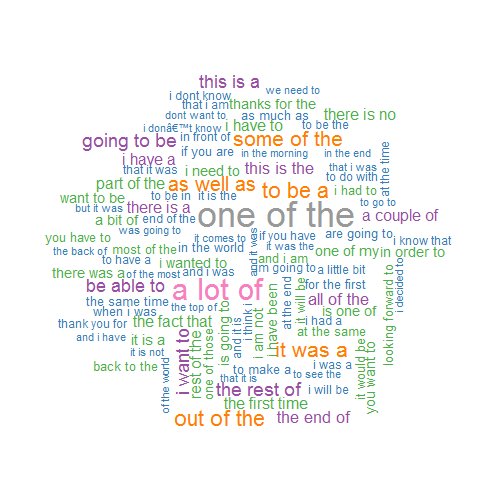

## Introduction

The purpose of the capstone project was to build a predictive text model from a large corpus of text documents 
using the skills learned in the Data Science Specialisation. 
New data science techniques of text analytics and natural language processing were required for the project. 
This report would explain the exploratory analysis the author has gone through 
to gain an understanding of the data given and outline the steps explored to achieve the goal of the project.

## Data

The data consisted of text documents in 4 different languages: English, Finnish, German and Russian. 
In each language, text documents were obtain from 3 sources: blogs, news and Twitter. 
For the purpose of this project, only the English documents were analysed 
and of which the predictive text model would be built on. 
Brief information of the documents was provided in the table below.


```
##         lineCount   docSize meanChar
## blogs      899288 260564320 231.6960
## news        77259  20111392 203.0024
## twitter   2360148 316037600  68.8029
```

Evidently, the documents contained varying amount of text data, with the Twitter document the largest 
and the news document the smallest, both in terms of number of lines and memory space taken. 
Specifically, the Twitter document contained 30.55 
times the number of lines and took 15.71 times 
the memory space compared to the news document. 
However, as expected, each line of the Twitter document contained less number of characters 
compared to the other 2 documents. 
Part of the reason was due to the 140 character limit restricted by Twitter.

## Exploratory Analysis

At this initial exploratory stage, no attempt was made to clean up the text documents 
to correct punctuations or spelling. 
The `strsplit()` function with argument `split = " "` was used directly to break the documents into individual words. 
The histogram of the word count per document by source type were shown below.



The histograms showed that the word count per document from each were distributed very differently. 
For blogs, the distribution was very skewed with a long right tail from long blog posts of over 200 words. 
However, there were quite a number with less than 15 words. 
For the news source, the distribution was less skewed with a mode number of words at around 30-40 per document. 
For Twitter, the documents had much fewer number of words as expected, with a mode of about 8 words.

## Building the Model

The language model would work with analysing ngrams from the documents. 
The documents would first need to be preprocessed by removing punctuations, 
striping excess whitespaces and converting to lower case.
The plan would be to then break down the documents into unigrams, bigrams and trigrams and 
count the frequencies of the ngrams. 
The frequency counts would then be normalised by the first (n-1) words ahead to form a probability vector. 
The probabilities would then be sorted in decreasing order, 
with the last words of the top 3 ngrams forming the suggestions for the app. 

To employ all the information of the unigram, bigram and trigrams available, 
the trigrams would first be used to create suggestions. 
If first 2 words could not be matched or the suggested word had a low probability, 
the bigram would then be used for suggestion, followed by the unigram. 
The unigram would basically be individual words sorted by count.

The word clouds below showed the top couple of hundred ngrams for unigrams, 
bigrams and trigrams respectively for a 1% random sample of documents provided.


**Unigram word cloud**


**Bigram word cloud**


**Trigram word cloud**
