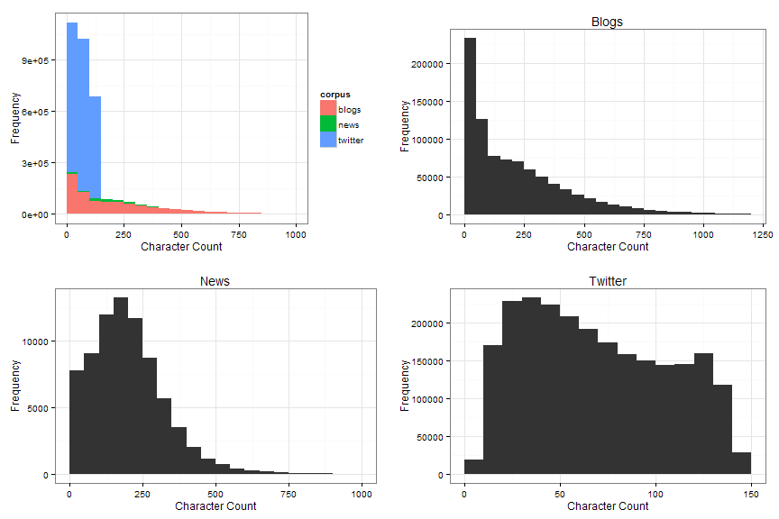
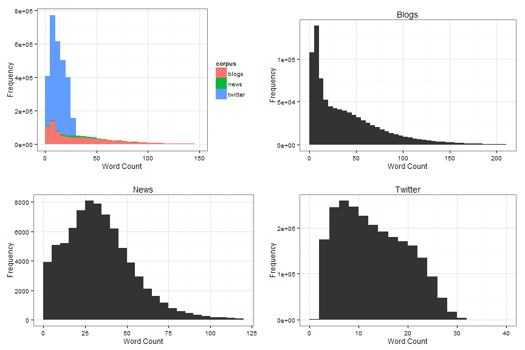
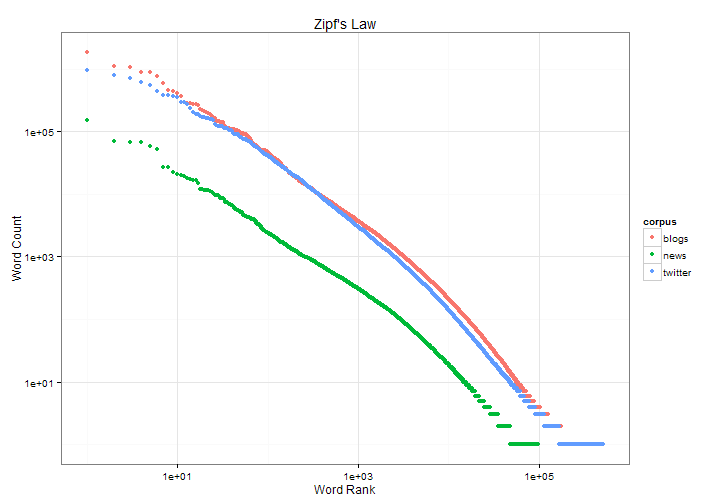
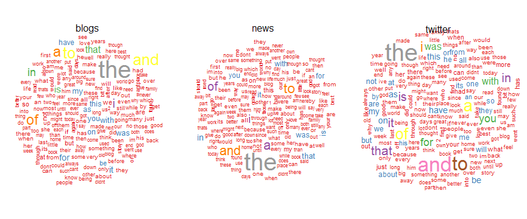

# Capstone Milestone Report


```r
library(plyr); library(dplyr); library(data.table)
library(stringi); library(tm); library(wordcloud)
library(ggplot2); library(gridExtra); library(RColorBrewer)
theme_set(theme_bw())
```

## Introduction

The purpose of the capstone project was to build a predictive text model from a large corpus of text documents 
using the skills learned in the Data Science Specialisation. 
New data science techniques of text analytics and natural language processing were required for the project. 
This report would explain the exploratory analysis I have gone through 
to gain an understanding of the data given and outline the steps explored to achieve the goal of the project.

## Data


```r
fnames <- c("blogs", "news", "twitter")
files <- paste0("./final/en_US/en_US.", fnames, ".txt")
texts <- llply(files, readLines, skipNul = T)
names(texts) <- fnames
```

The data consisted of text documents in 4 different languages: English, Finnish, German and Russian. 
In each language, text documents were obtain from 3 sources: blogs, news and Twitter. 
For the purpose of this project, only the English documents were analysed 
and of which the predictive text model would be built on. 
Brief information of the documents was provided in the table below.


```r
size <- sapply(texts, object.size)
line.cnt <- laply(texts, length)
char.cnt <- llply(texts, stri_length)
char.total <- laply(char.cnt, sum)
(df.exp <- data.frame(line.cnt, size, char.total, 
                     size.mean = size / line.cnt, 
                     char.mean = char.total / line.cnt))
```

```
##         line.cnt      size char.total size.mean char.mean
## blogs     899288 260564320  208361438  289.7451  231.6960
## news       77259  20111392   15683765  260.3113  203.0024
## twitter  2360148 316037600  162385035  133.9058   68.8029
```

Evidently, the corpora contained varying amount of text data, with the Twitter corpus the largest 
and the News corpus the smallest, both in terms of number of lines and memory space taken.
For character counts, the Blogs corpus was the largest, while the News corpus was again the smallest.
Specifically, the Twitter corpus contained 30.55 
times the number of lines, took 15.71 times 
the memory space and contained 10.35 times
the character count compared to the News corpus. 
The different sizes meant that when building the ngram model later, it may not be ideal to take count
at the surface level as the Twitter corpus may be over represented in the model.

However, if one were to look at the mean size per line, the comparisons were different.
The average sizes of the Blogs and News corpora were similar in terms 
of memory space and character count.
On the other hand, as expected, on average, each line of the Twitter corpus 
took the smallest memory space and contained the least number of characters. 
Part of the reason was due to the 140 character limit restricted by Twitter.
As a result, the length of tweets are typically not very long.

## Preprocessing and Text Cleaning


```r
before <- texts$blogs[3]
clean_text <- function(s) {
    # convert encoding to ascii
    s <- iconv(s, to = "ascii", sub = "")
    # convert to lower case
    s <- stri_trans_tolower(s)
    # remove punctuations
    s <- removePunctuation(s)
    return(s)
}
texts <- llply(texts, clean_text)
after <- texts$blogs[3]
words <- llply(texts, stri_split_boundaries, type = "word", skip_word_none = T)
```

Preprocessing and cleaning is an important step of text analytics to standardise the input documents. 
Steps include converting the text to lowercase and removing punctuations.
Fortunately, the `tm` package simplified this process by providing useful functions for the typical 
preprocessing steps. 
I also converted the text into ASCII to remove Unicode characters to simplify the modelling process later.
Additional preprocessing steps can also be done to correct spelling errors, handle numbers appropriately
and remove hyperlinks and profanities. However, these were not done at this exploratory stage.

The cleaned text were then split into words using using the `stri_split_boundaries` from the `stringi` package.

## Exploratory Analysis


```r
# get word count and prepare data frame
word.cnt <- llply(words, laply, length)
df.wc <- ldply(word.cnt, data.frame)
setnames(df.wc, c("corpus", "word.count"))
# prepare data frame for character count
df.cc <- ldply(char.cnt, data.frame)
setnames(df.cc, c("corpus", "char.count"))
```

The lists of character and word counts were then converted into data frames 
before doing histogram plots to have an idea of the distributions.

### Character Counts


```r
p1 <- qplot(char.count, data = df.cc, geom = "histogram", fill = corpus,
            xlim = c(0, 1000), binwidth = 50,
            xlab = "Character Count", 
            ylab = "Frequency")

p2 <- qplot(char.count, data = subset(df.cc, corpus == "blogs"), 
            xlim = c(0, 1200), binwidth = 50,
            main = "Blogs",
            xlab = "Character Count", 
            ylab = "Frequency")

p3 <- qplot(char.count, data = subset(df.cc, corpus == "news"),
            xlim = c(0, 1000), binwidth = 50,
            main = "News",
            xlab = "Character Count", 
            ylab = "Frequency")

p4 <- qplot(char.count, data = subset(df.cc, corpus == "twitter"),
            xlim = c(0, 150), binwidth = 10,
            main = "Twitter",
            xlab = "Character Count", 
            ylab = "Frequency")

grid.arrange(p1, p2, p3, p4, ncol = 2)
```



The histograms of character counts of the documents were very different depending on the corpus.
For the Blogs corpus, there were large number of documents with character counts less than 100, 
which then tailed off slowly.
For the News corpus, many documents had character counts between 100 and 250, which tailed off very quickly.

For the Twitter corpus, most documents have character counts below 150 as restricted by Twitter.
The documents are quite evenly distributed with character counts between 10 and 140.
Curiously, there are a number of documents with character counts above the 140 limit.
This may be due to the data not being processed in the right manner.

### Word Counts


```r
p1 <- qplot(word.count, data = df.wc, geom = "histogram", fill = corpus,
            xlim = c(0, 150), binwidth = 5,
            xlab = "Word Count", 
            ylab = "Frequency")

p2 <- qplot(word.count, data = subset(df.wc, corpus == "blogs"), 
            xlim = c(0, 210), binwidth = 5,
            main = "Blogs",
            xlab = "Word Count", 
            ylab = "Frequency")

p3 <- qplot(word.count, data = subset(df.wc, corpus == "news"), 
            xlim = c(0, 120), binwidth = 5,
            main = "News",
            xlab = "Word Count", 
            ylab = "Frequency")

p4 <- qplot(word.count, data = subset(df.wc, corpus == "twitter"),
            xlim = c(0, 40), binwidth = 2,
            main = "Twitter",
            xlab = "Word Count", ylab = "Frequency")

grid.arrange(p1, p2, p3, p4, ncol = 2)
```



The histograms for word counts followed those for character counts.
There were large numbers of Blogs with less than 15 words, 
while for News, the documents were mostly between 15 and 45 words.
The distribution for Blogs was very skewed with a long right tail. 
For the Twitter corpus, the distribution was not as skewed with a large number between 4 and 12 words.

## Word Frequencies

At this point, with the corpus cleaned and words split, it would be possible to obtain
the word frequencies to demonstrate typical characteristics of corpora of natural language
and also show the similarity of word popularity between the 3 corpura.


```r
# create word vector and convert to factor for manipulation
words <- llply(words, unlist)
words <- llply(words, factor)
# compute word frequencies and convert to data frame
word.fq <- llply(words, table)
word.fq <- llply(word.fq, sort, decreasing = T)
word.tbl <- ldply(word.fq, function(wc) data.frame(rank = seq_along(wc), count = wc, word = names(wc)))
setnames(word.tbl, ".id", "corpus")
# compute proportion metrics
word.tbl <- group_by(word.tbl, corpus) %>%
    mutate(rank.prop = rank / max(rank), 
           count.prop = count / sum(count),
           count.prop.cum = cumsum(count.prop))
# reorder factor levels by word popularity
word.tbl <- mutate(word.tbl, word = reorder(word, desc(count.prop), sum))
```

### Zipf's Law

According to [Zipf's Law](https://en.wikipedia.org/wiki/Zipf%27s_law), in natural language corpora,
the frequency of any word is inversely proportional to its rank in the frequency table.
This can be demonstrated on a log-log plot of rank against frequencies of the words, as shown below.
Ideally, the plot should follow $y = 1/x$, which in log-log plots would be $log(y) = -log(x)$.
This should show as a decreasing straight line with gradient of -1.


```r
qplot(rank, count, data = word.tbl,
      color = corpus, group = corpus,
      log = "xy",
      main = "Zipf's Law",
      xlab = "Word Rank",
      ylab = "Word Count")
```



While the points do not form a straight line as preferred, interestingly, they form similar curves
although the three corpora are very different in nature. 
In fact, the plots for the Blogs and Twitter corpura overlapped at a few parts.
The observations appeared to agree with Zipf's Law.
Although the sizes of the corpura were very different, they were all well represented in the same plot
due to the log transformations on both axes.

### Word Cloud

Let's now look at the word cloud to have a good idea of the top 200 most popular words in each corpus.


```r
op <- par(mfrow = c(1, 3))
l_ply(names(word.fq), function(c) {
    with(subset(word.tbl, corpus == c), 
         wordcloud(word, count, scale = c(5, 1), max.words = 200,
                   colors = brewer.pal(9, "Set1")))
    text(0.5, 1, labels = c, cex = 2)
})
par(op)
```



Having a quick look showed that there was not too much variety in the most popular words.
In fact, most of the words are the stop words, which are the common words in the English language.
The stop words can be obtained directly from the `tm` package, as followed.


```r
removePunctuation(stopwords())
```

```
##   [1] "i"          "me"         "my"         "myself"     "we"        
##   [6] "our"        "ours"       "ourselves"  "you"        "your"      
##  [11] "yours"      "yourself"   "yourselves" "he"         "him"       
##  [16] "his"        "himself"    "she"        "her"        "hers"      
##  [21] "herself"    "it"         "its"        "itself"     "they"      
##  [26] "them"       "their"      "theirs"     "themselves" "what"      
##  [31] "which"      "who"        "whom"       "this"       "that"      
##  [36] "these"      "those"      "am"         "is"         "are"       
##  [41] "was"        "were"       "be"         "been"       "being"     
##  [46] "have"       "has"        "had"        "having"     "do"        
##  [51] "does"       "did"        "doing"      "would"      "should"    
##  [56] "could"      "ought"      "im"         "youre"      "hes"       
##  [61] "shes"       "its"        "were"       "theyre"     "ive"       
##  [66] "youve"      "weve"       "theyve"     "id"         "youd"      
##  [71] "hed"        "shed"       "wed"        "theyd"      "ill"       
##  [76] "youll"      "hell"       "shell"      "well"       "theyll"    
##  [81] "isnt"       "arent"      "wasnt"      "werent"     "hasnt"     
##  [86] "havent"     "hadnt"      "doesnt"     "dont"       "didnt"     
##  [91] "wont"       "wouldnt"    "shant"      "shouldnt"   "cant"      
##  [96] "cannot"     "couldnt"    "mustnt"     "lets"       "thats"     
## [101] "whos"       "whats"      "heres"      "theres"     "whens"     
## [106] "wheres"     "whys"       "hows"       "a"          "an"        
## [111] "the"        "and"        "but"        "if"         "or"        
## [116] "because"    "as"         "until"      "while"      "of"        
## [121] "at"         "by"         "for"        "with"       "about"     
## [126] "against"    "between"    "into"       "through"    "during"    
## [131] "before"     "after"      "above"      "below"      "to"        
## [136] "from"       "up"         "down"       "in"         "out"       
## [141] "on"         "off"        "over"       "under"      "again"     
## [146] "further"    "then"       "once"       "here"       "there"     
## [151] "when"       "where"      "why"        "how"        "all"       
## [156] "any"        "both"       "each"       "few"        "more"      
## [161] "most"       "other"      "some"       "such"       "no"        
## [166] "nor"        "not"        "only"       "own"        "same"      
## [171] "so"         "than"       "too"        "very"
```

## Building the Model

The predictive text model will be based on the ngram language model.
This will require obtaining the frequencies of ngrams, for n perhaps up to 4 or 5.
With the word vectors, it will be straightforward to obtain the ngrams,
by binding the word vectors together with index displaced by an increasing number.
The difficulty will be counting the ngrams and normalising them to 
proportion figures to allow for comparison.
Given the number of possible combination of ngrams and the size of the corpus, I foresee that it will
be a computationally expensive process, hence some form of simplification may be required,
perhaps by removing ngrams with low frequencies.

I am imagining using different level of ngrams for prediction and using some form of mixture or backoff
model to combine the predictions. This does not appear straightforward at the moment.

Hence, the following steps will be required:

- generate ngrams from the corpus, for n up to 4 or 5
- count the ngrams
- normalise the counts by the first (n-1) words to obtain proportion figures
- apply smoothing on the proportion figures between different levels of n
- consider applying different weights to the different corpus

To build the the final app, the additional steps will be:

- prepare a preprocessing function for the user input text
- obtain ngrams of different levels from the processed inputs
- prepare a function to rank predictions based on the smoothed ngram proptions
- show to top (or possibly top few) predictions
- add buttons to simplify user input of predicted words
- perhaps include options to allow user to adjust weights between different corpus
