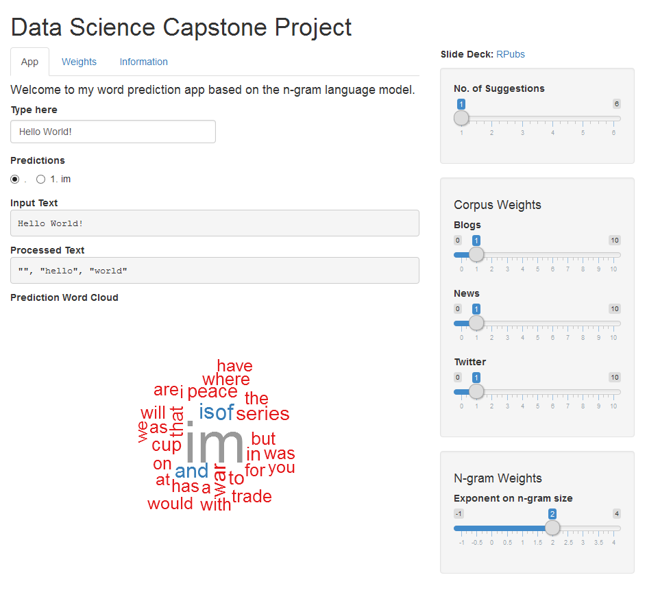

Data Science Capstone Pitch
========================================================
author: YuXuan Tay
date: Monday, August 03, 2015

Prediction Model
========================================================

- based on the N-Gram Language Model on the [HC Corpora](http://www.corpora.heliohost.org/)
 - blogs, news and Twitter corpora of the English language
- preprocessing, such as sentence detection, punctuation removal and converting to lowercase were performed
- word splitting was then done, with sentence beginning, numbers and rare words (with counts <= 5) 
represented by special symbols, to create a vectors of words for each corpus
- n-grams of size up to 5 were generated by binding the word vector repeatedly
with index displaced
- n-grams were then counted and normalised into proportion based on the first (n-1) words of the n-gram
- packages such as `stringi` and `data.table` were used

Prediction Steps
========================================================

- input text is cleaned in the similar manner as the corpora and the last 5 words extracted
- predictions based on different n-gram sizes are obtained from each corpora
- prediction confidence are combined based on a smoothing function for different n-gram sizes
and based on preset weights for the different corpora
- previous step incorporates backoff automatically in the event only small n-grams can be found
- predicted words with top 5 confidence are presented as suggestions

========================================================

[My Shiny App](https://yxtay.shinyapps.io/dsc-shiny)

Features
========================================================

- suggestion(s) displayed as button(s) for user interaction
- user input text updates with user selected suggestion
- processing steps and prediction table presented to offer hints of underlying steps
- prediction word cloud gives idea of word prediction confidence
- number of suggestions can be increased up to 6
- adjustable corpus and ngram weights for advance users
