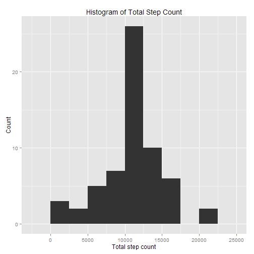

# Reproducible Research: Peer Assessment 1


```r
# loading packages
library(plyr)
library(ggplot2); library(scales)
```

## Loading and preprocessing the data


```r
if(!file.exists("activity.csv")) unzip("activity.zip")
df <- read.csv("activity.csv")
```

It would also be appropriate to preprocess the date and time variables.


```r
df <- mutate(df,
             date = as.Date(date),
             interval = sprintf("%04d", interval),
             time = strptime(interval, "%H%M"),
             datetime = strptime(paste(date, interval), "%F %H%M"))
```


## What is mean total number of steps taken per day?

It would first be necessary to sum the number of steps by day. 
This can be achieved by using the `ddply()` function in the `plyr` pacakge.


```r
df_days <- ddply(df, .(date), summarise, steps = sum(steps, na.rm = T))
qplot(steps, data = df_days, geom = "histogram",
      main = "Histogram of Number of Steps",
      xlab = "Number of steps", ylab = "Count")
```


```r
steps_mean <- mean(df_days$steps)
steps_median <- median(df_days$steps)
```

The mean number of steps per day is **9354**.

The median number of steps per day is **10395**.

## What is the average daily activity pattern?

The average number of steps at each time period can be computed with the use of the `ddply()` function.


```r
df_daily <- ddply(df, .(time), summarise, steps = mean(steps, na.rm = T))

qplot(time, steps, data = df_daily, geom = "line",
      main = "Average Daily Activity Pattern",
      xlab = "Time", ylab = "Number of steps") +
    scale_x_datetime(labels = date_format("%H:%M"))
```


```r
steps_max <- max(df_daily$steps)
max_interval <- with(df_daily, format(time[which.max(steps) + 0:1], "%H:%M"))
```

The maximum average number of steps of **206.17** happened between **08:35** and **08:40**.

## Imputing missing values


```r
id_na <- is.na(df$steps)
NAcount <- sum(id_na)
```

The total number of missing values is **2304**.

I chose to fill the missing values by taking the average number of steps at
each time period which was calculated in the previous part.
It would be necessary to match the missing value to the appropriate average value by time period,
which is achieved by the following codes:


```r
idx <- match(df$time[id_na], df_daily$time)
df2 <- within(df, {steps[id_na] <- df_daily$steps[idx]})
```

The histogram was then plotted and the mean and median computed.


```r
df_daily2 <- ddply(df2, .(date), summarise, steps = sum(steps, na.rm = T))
qplot(steps, data = df_daily2, geom = "histogram",
      main = "Histogram of Total Step Count",
      xlab = "Total step count")
```



```r
steps_mean2 <- mean(df_daily2$steps)
steps_median2 <- median(df_daily2$steps)
```

The mean and median number of steps per day are **10766** and **10766** respectively.

These values differ from the estimatess from earlier.
From the histogram, there was an increase in the number of days where
the total number of steps fall within 10500 and 11000.
The mean and median had also increased.
On closer inspection of the original data frame, when missing values happened,
they happened throughout the whole day.
The data from these days were replaced by the average daily pattern,
hence all of them had the same total number of steps.
There were 8 such days. 

## Are there differences in activity patterns between weekdays and weekends?

The data frame was first split into data for weekdays and another one for weekends.
Next, the number of steps per 5 min interval was averaged over all the days by interval
in each data frame before a time series plot was plotted.


```r
df2 <- mutate(df2,
              day = weekdays(date),
              weekend = ifelse(is.element(day, c("Saturday", "Sunday")), "Weekend", "Weekday"))

df_weekend <- ddply(df2, .(time, weekend), summarise,
                    steps = mean(steps))
qplot(time, steps, data = df_weekend, geom = "line", facets = weekend ~ .,
      xlab = "Time", ylab = "Number of steps") +
    scale_x_datetime(labels = date_format("%H:%M"))
```


From the panel plots, it could be observed that the average step count for weekdays
was generally higher in the morning before 10:00. 
This indicated that the user was more active during early morning in weekdays than in weekends.
After that, there was not much difference for the rest of the day. 
Although the step count may be slightly higher in the weekend for the rest of the day,
the difference was not huge.
