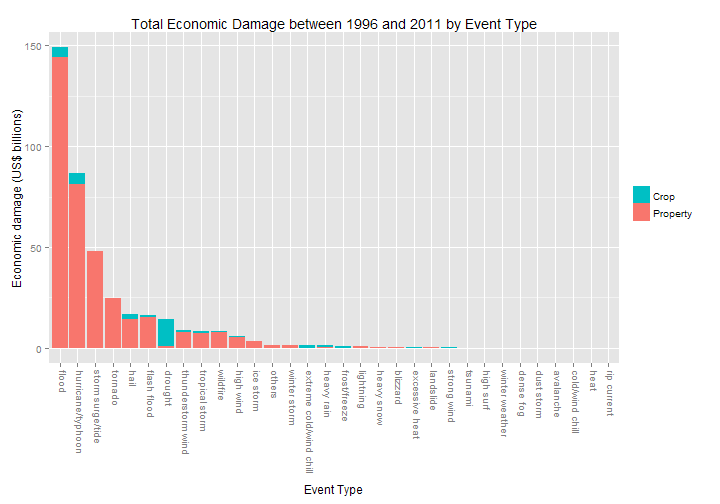

Analysing Human and Economic Costs of Weather-related Risks
===========================================================


Executive Summary
-----------------

Using the U.S. National Oceanic and Atmospheric Administration's storm database, 
the risks of major storm and weather events in the United States were analysed to evaluate
which type of events had the highest costs, in terms of human health and economic damange.
After cleaning the event classification to the officially recognised ones, 
they were ranked by total number of casualties and by economic damages.
The most damaging event type to human health was tornado, 
while the one causing the most economic damage was flood.

Data
----


```r
# loading packages
library(plyr); library(ggplot2); library(reshape2)
```

The Storm Event Database was recorded by the U.S National Oceanic and Atmospheric Administration (NOAA).
It recorded occurrence of storms and other significant weather phenomena between 1950 and 2011.
There was information available for the date of event, state, coordinates of location, event type, 
number of fatalities, number of injuries, value of property damage, etc.
There were more than 900 thousand records.

According to the [NOAA website](http://www.ncdc.noaa.gov/stormevents/details.jsp?type=eventtype),
the data collection of all the current 48 event types began in 1996. 
As such data before 1996 were excluded in the analysis. This left the record count at just over 650 thousand.


```r
storm_df <- read.csv("repdata-data-StormData.csv.bz2", stringsAsFactors = F)
storm_df <- mutate(storm_df, BGN_DATE = as.Date(BGN_DATE, "%m/%e/%Y 0:00:00"))
storm_df2 <- subset(storm_df, BGN_DATE > "1995-12-31")
names(storm_df2) <- tolower(names(storm_df2))
```

Next, only the columns of interest, as shown below, were kept.


```r
print(var_keep <- names(storm_df2)[c(2:4,7:8,23:28)])
storm_df2 <- subset(storm_df2, select = var_keep)
```

```
##  [1] "bgn_date"   "bgn_time"   "time_zone"  "state"      "evtype"    
##  [6] "fatalities" "injuries"   "propdmg"    "propdmgexp" "cropdmg"   
## [11] "cropdmgexp"
```

Data Processing
---------------

I first focused on the quantitative variables. It was necessary to combine the information
contained the economic damage variables and their exponents.
A summary of the exponent variables revealed that they referred to thousands, millions and billions.


```r
table(storm_df2$propdmgexp)
```

```
## 
##             0      B      K      M 
## 276185      1     32 369938   7374
```


```r
table(storm_df2$cropdmgexp)
```

```
## 
##             B      K      M 
## 373069      4 278686   1771
```

They were combined with the economic damage variables in the following codes.
At the same time, I added the fatality and injury counts together to obtain the summary for human costs
and the property and crop damages to get the summary for economic consequences.


```r
expchr <- c("K", "M", "B"); exp10 <- 10 ^ c(3, 6, 9, 0)
storm_df2 <- mutate(storm_df2, 
                    propdmgmult = exp10[match(propdmgexp, expchr, nomatch = 4)],
                    cropdmgmult = exp10[match(cropdmgexp, expchr, nomatch = 4)],
                    propdmg = propdmg * propdmgmult,
                    cropdmg = cropdmg * cropdmgmult,
                    totaldmg = propdmg + cropdmg,
                    casualties = fatalities + injuries,
                    evtype = tolower(evtype))
```

A preliminary look at the event type classification of the dataset revealed that there were substantial
errors in recording. There were 438 unique entries of event types 
although there were only 48 officially recognised ones. 
As such it was necessary to clean up the event type classification of the dataset.

Since this analysis was interested in the costs of these events,
the events which did not result in any costs were removed to 
reduce the number of events involved.


```r
storm_df3 <- subset(storm_df2, totaldmg != 0 | casualties != 0, 
                    select = c(evtype, fatalities, injuries, casualties, propdmg, cropdmg, totaldmg))
```

To focus our clean up efforts on the events that sustain large costs, it would be wise
to rank the events by total costs and handle the events that were responsible for,
say, 99% of the total costs. To do this, the costs were summed together by the raw event type.
They were then sorted and the cumulative sum was computed to identify the cutoff
for 99% of the total costs.


```r
storm_sum <- ddply(storm_df3, .(evtype), colwise(sum))
print(n <- laply(storm_sum[, c(4,7)], 
                  function(x, prop) which((cumsum(sort(x, decreasing = T)) / sum(x)) > prop)[1], 
                  prop = 0.99))
```

```
## [1] 44 22
```

For human costs, the top 44 raw event types accounted for at least 99% of total,
while for economic consequence, it was the top 22  raw event types.


```r
id_list <- mapply(function(x, n) head(order(x, decreasing = T), n), storm_sum[, c(4,7)], n)
print(id <- sort(unique(do.call(c, id_list))))
```

```
##  [1]   8  11  26  29  32  36  39  42  43  46  48  50  57  59  66  69  70
## [18]  71  74  76  78  80  83  86  88  94  99 107 127 128 141 142 143 146
## [35] 149 152 153 163 164 170 176 177 178 182 183 184 185 186
```

Next, the indexes of of those event type were identified. 
The number of raw event types involved at this stage was 48, substantially lower than
what we began with initially.

The event types corresponding to these indexes were then extracted. Those that were not in the 
list of 48 recognised weather event types were assigned the most appropriate labels.
The rest of the unextracted event types were assigned to "others".
A check was done to ensure all assigned event types came from the official list.


```r
events <- storm_sum$evtype[id]
# 48 officially recognised event types
event_type <- c("astronomical low tide", "avalanche", "blizzard", "coastal flood", 
                "cold/wind chill", "dense fog", "dense smoke", "drought",  
                "dust devil", "dust storm", "excessive heat", "extreme cold/wind chill",
                "flash flood", "flood", "freezing fog", "frost/freeze",
                "funnel cloud", "hail", "heat", "heavy rain",
                "heavy snow", "high surf", "high wind", "hurricane/typhoon", 
                "ice storm", "lakeshore flood", "lake-effect snow", "landslide",
                "lightning", "marine hail", "marine high wind", "marine strong wind", 
                "marine thunderstorm wind", "rip current", "seiche", "sleet",
                "storm surge/tide", "strong wind", "thunderstorm wind", "tornado",
                "tropical depression", "tropical storm", "tsunami", "volcanic ashfall",
                "watersprout", "wildfire", "winter storm", "winter weather")
events2 <- event_type[match(events, event_type)]
events2[is.na(events2)] <- c("extreme cold/wind chill", "dense fog", "winter weather", "excessive heat", 
                             "high surf", "high surf", "hurricane/typhoon", "rip current", 
                             "storm surge/tide", "thunderstorm wind", "thunderstorm wind", "flood", 
                             "wildfire", "strong wind", "winter weather", "winter weather", 
                             "winter weather")
all(events2 %in% event_type)
```

```
## [1] TRUE
```

The output below showed how the unmatched event types were assigned to those on the official list.


```r
cbind(events, events2)[events != events2,]
storm_sum$evtype2 <- "others"
storm_sum$evtype2[id] <- events2
```

```
##       events                 events2                  
##  [1,] "extreme cold"         "extreme cold/wind chill"
##  [2,] "fog"                  "dense fog"              
##  [3,] "glaze"                "winter weather"         
##  [4,] "heat wave"            "excessive heat"         
##  [5,] "heavy surf"           "high surf"              
##  [6,] "heavy surf/high surf" "high surf"              
##  [7,] "hurricane"            "hurricane/typhoon"      
##  [8,] "rip currents"         "rip current"            
##  [9,] "storm surge"          "storm surge/tide"       
## [10,] "tstm wind"            "thunderstorm wind"      
## [11,] "tstm wind/hail"       "thunderstorm wind"      
## [12,] "urban/sml stream fld" "flood"                  
## [13,] "wild/forest fire"     "wildfire"               
## [14,] "wind"                 "strong wind"            
## [15,] "winter weather mix"   "winter weather"         
## [16,] "winter weather/mix"   "winter weather"         
## [17,] "wintry mix"           "winter weather"
```

Finally, the data cleaning was completed. The costs of the events could then be summed up
for the final time.


```r
storm_sum2 <- ddply(storm_sum[, -1], .(evtype2), colwise(sum))
storm_sum3 <- melt(storm_sum2, id.vars = "evtype2")
storm_sum2$evtype2
```

```
##  [1] "avalanche"               "blizzard"               
##  [3] "cold/wind chill"         "dense fog"              
##  [5] "drought"                 "dust storm"             
##  [7] "excessive heat"          "extreme cold/wind chill"
##  [9] "flash flood"             "flood"                  
## [11] "frost/freeze"            "hail"                   
## [13] "heat"                    "heavy rain"             
## [15] "heavy snow"              "high surf"              
## [17] "high wind"               "hurricane/typhoon"      
## [19] "ice storm"               "landslide"              
## [21] "lightning"               "others"                 
## [23] "rip current"             "storm surge/tide"       
## [25] "strong wind"             "thunderstorm wind"      
## [27] "tornado"                 "tropical storm"         
## [29] "tsunami"                 "wildfire"               
## [31] "winter storm"            "winter weather"
```

In the end, excluding those labeled as "others", only 31 event types remained.

Results
-------

To simplify comparison, the event types were ranked by cost of interest and plotted in a barplot.


```r
qplot(reorder(evtype2, desc(value), sum), 
      data = droplevels(subset(storm_sum3, variable %in% c("fatalities", "injuries"))), 
      weight = value / 10^3, fill = reorder(variable, desc(value), sum),
      main = "Total Number of Casualties between 1996 and 2011 by Event Type",
      xlab = "Event Type", ylab = "Casualties ('000)") + 
    scale_fill_discrete("", labels = c("Injuries", "Fatalities"), guide = guide_legend(rev = T)) +
    theme(axis.text.x = element_text(angle = -90, hjust = 0, vjust = 0.5))
```


In terms of events most harmful to human health, the most costly was tornado, 
which resulted in more than 20 thousand injuries and about 1500 deaths in the 15 years.
The next 4 event types (excessive heat, flood, thunderstorm wind and lightning) were also very harmful.


```r
qplot(reorder(evtype2, desc(value), sum), 
      data = droplevels(subset(storm_sum3, variable %in% c("fatalities", "injuries"))),
      weight = value / 10^9, fill = reorder(variable, desc(value), sum),
      main = "Total Economic Damage between 1996 and 2011 by Event Type",
      xlab = "Event Type", ylab = "Economic damage (US$ billions)") + 
    scale_fill_discrete("", labels = c("Property", "Crop"), guide = guide_legend(rev = T)) +
    theme(axis.text.x = element_text(angle = -90, hjust = 0, vjust = 0))
```



In terms of events with greatest economic consequences, flood was clearly the most significant.
Hurricane, storm surge and tornado events also caused large economic damages. 
Comparatively, the remaining events did not cause as excessive damages,
hence, it would be paramount to focus efforts to the top 4 events first to reduce economic damages.
