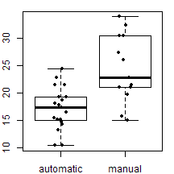
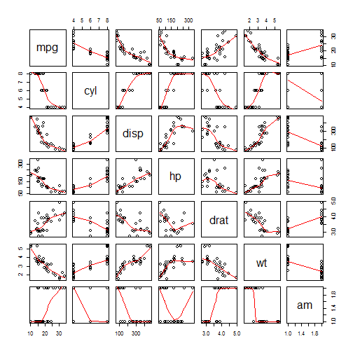
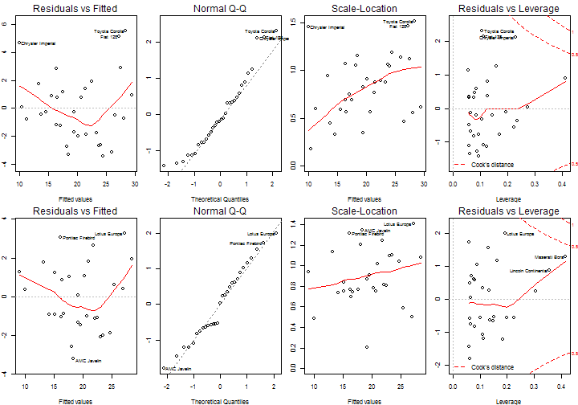

Is an automatic or manual transmission better for MPG?
======================================================

## Executive Summary

Fuel consumption is often an important factor to consider when deciding an economic car to purchase.
It has always been recommended that buyers opt for a manual transmission for an improvement in fuel consumption.
Is statement justified? A study was done on 32 cars models from 1973 and 1974, 
13 of which had manual transmissions with the rest automatic.
After controlling for a number of variables such as weight of the car and engine power,
it was concluded cars with manual transmission indeed showed a better fuel consumption 
(**+0.5056** miles per gallon) than those with automatic transmission. 
However, it may not be an important factor of fuel consumption compared to the other variables.

## Data

The data was obtained from the `datasets` R package 
([documentation](http://stat.ethz.ch/R-manual/R-devel/library/datasets/html/mtcars.html)). 
According to the documentation, it was extracted from the 1974 Motor Trend US magazine. 
It comprised of fuel consumption and 10 aspects of automobile design and performance 
for 32 automobiles from 1973 and 1974; 
13 of them had manual transmission compared to 19 on automatic.

The variables included were: fuel consumption in miles per US gallon (MPG) (`mpg`),
number of cylingers (`cyl`), iengine displacement in cubic inches (`disp`), gross housepower(`hp`), 
real axle ratio (`drat`), weight in 1000 pounds (`wt`), quarter mile time in seconds (`qsecs`), 
engine configuration (`vs`), transmission (`am`), number of forward gears (`gears`) 
and number of carburetors (`carb`).

## Exploratory Data Analysis

The comparison between the fuel consumption of cars with manual and automatic transmission 
can be easily done through through a boxplot which was shown in the appendix.


It was evident from the boxplots that cars with manual transmission had higher MPG.
The ANOVA comparing the fuel consumption against different transmission showed that 
the cars with manual transmission was associated with **7.2449** increase in MPG.
However, such an analysis did not take into account controlling other variables
which might have affected MPG, hence the conclusion could not be taken at face value.

The pairs scatterplots in the appendix gave us a brief idea of how some of the continuous variables
were related to MPG and each other.
It could be observed that mpg appeared to be highly correlated with all the variables 
except rear axle ratio and transmission, but showed some correlation with those nonetheless.


## Analysis

It would be easy to simply include all the variables into a single regression model 
and obtain the coefficient for the transimission variable 
for the difference in MPG between manual and automatic cars.
However, such a model would be unnecessarily complex, 
difficult to interprete and include insignificant variables.
Nevertheless, it would be a model based on which the subsequent models would be constructed.
The p-values of the coefficients of this model were as followed.


```
##          wt    ammanual        qsec          hp        disp (Intercept) 
##     0.06325     0.23399     0.27394     0.33496     0.46349     0.51812 
##        drat        gear        carb   vsIengine         cyl 
##     0.63528     0.66521     0.81218     0.88142     0.91609
```

By ranking the p-value of the coefficients in the ascending order,
I removed the variables corresponding to the 3 least significant coefficients 
(`cyl, vsIengine, carb`).
The variable for quarter mile time was also removed since it was not a manufacturer specification
and, hence, the coefficient would be difficult to interprete.


```
## (Intercept)          hp          wt    ammanual        drat        disp 
##   0.0002817   0.0077548   0.0166362   0.4710325   0.5190745   0.6052971 
##        gear 
##   0.7491696
```

From the table of coefficients of the resulting model, engine power (p-value: 0.654) 
and car weight (p-value: 0.5191) were the only 2 signigicant variables.
Transmission would also be included since the coefficient of which was of interest.


To ensure that variables were not rejected carelessly, the ANOVA was conducted 
between the final model and the previous model. With a large p-value (0.857), 
the final model was not rejected for the alternative model which included 3 more variables.
Hence, it was a valid model.


```
## Analysis of Variance Table
## 
## Model 1: mpg ~ hp + wt + am
## Model 2: mpg ~ disp + hp + drat + wt + am + gear
##   Res.Df RSS Df Sum of Sq    F Pr(>F)
## 1     28 180                         
## 2     25 175  3      5.35 0.26   0.86
```

It would also be necessary to check the diagnostic plots to check for the model fit and outliers.
From the diagnostic plots in the appendix, the points for Chrysler Imperial, Fiat 128 and Toyota Corolla 
appeared to be a significant outliers. They were removed from subsequent analysis as they may influence the analysis. 
The diagnostic plots were more satisfactory after their removal.


## Results

The final model and its coefficients were as followed:


Therefore, controlling for engine power and car weight, cars with manual transmission 
have a better fuel consumption of **0.5056** increase in MPG.
The 95% confidence interval for the increase in MPG was **(-1.6357, 2.6468)**.
Since the confidence interval contained 0, it meant that the difference in fuel consumption
between cars with manual and automatic transmission was not significant.
Other factors such as engine power and car weight were more important factors
affecting fuel consumption. 

Hence, this study was inconclusiveon whether the transmission type affected fuel consumption.
Part of the reason was due to the limited dataset of just 32 observations.
Perhaps a study conducted on a larger dataset would yield a different conclusion.

\newpage

Appendix
========

R codes and outputs were included for reproducibility.


```r
data(mtcars)
mtcars2 <- within(mtcars, {
    am <- factor(am, labels = c("automatic", "manual"))
    vs <- factor(vs, labels = c("Vengine", "Iengine"))
})

op <- par(mar = c(2,2,1,1))
boxplot(mpg ~ am, data = mtcars2)
stripchart(mpg ~ am, data = mtcars2, vertical = T, method = "jitter", pch = 20, add = T)
par(op)
```

 


```r
fit1 <- lm(mpg ~ am, data = mtcars2)
coef1 <- summary(fit1)$coef
coef1
```

```
##             Estimate Std. Error t value  Pr(>|t|)
## (Intercept)   17.147      1.125  15.247 1.134e-15
## ammanual       7.245      1.764   4.106 2.850e-04
```

```r
pairs(mtcars2[, c(1:6,9)], panel = panel.smooth)
```

 

```r
fit2 <- lm(mpg ~ ., data = mtcars2)
summary(fit2)$coef
```

```
##             Estimate Std. Error t value Pr(>|t|)
## (Intercept) 12.30337   18.71788  0.6573  0.51812
## cyl         -0.11144    1.04502 -0.1066  0.91609
## disp         0.01334    0.01786  0.7468  0.46349
## hp          -0.02148    0.02177 -0.9868  0.33496
## drat         0.78711    1.63537  0.4813  0.63528
## wt          -3.71530    1.89441 -1.9612  0.06325
## qsec         0.82104    0.73084  1.1234  0.27394
## vsIengine    0.31776    2.10451  0.1510  0.88142
## ammanual     2.52023    2.05665  1.2254  0.23399
## gear         0.65541    1.49326  0.4389  0.66521
## carb        -0.19942    0.82875 -0.2406  0.81218
```

```r
fit3 <- lm(mpg ~ disp + hp + drat + wt + am + gear, data = mtcars2)
summary(fit3)$coef
```

```
##              Estimate Std. Error t value  Pr(>|t|)
## (Intercept) 28.962452    6.86448  4.2192 0.0002817
## disp         0.006283    0.01200  0.5234 0.6052971
## hp          -0.041919    0.01448 -2.8952 0.0077548
## drat         1.006269    1.53861  0.6540 0.5190745
## wt          -3.065995    1.19449 -2.5668 0.0166362
## ammanual     1.349766    1.84418  0.7319 0.4710325
## gear         0.413313    1.27849  0.3233 0.7491696
```

```r
fit4 <- lm(mpg ~ hp + wt + am, data = mtcars2)
anova(fit4, fit3)
```

```
## Analysis of Variance Table
## 
## Model 1: mpg ~ hp + wt + am
## Model 2: mpg ~ disp + hp + drat + wt + am + gear
##   Res.Df RSS Df Sum of Sq    F Pr(>F)
## 1     28 180                         
## 2     25 175  3      5.35 0.26   0.86
```


```r
outliers <- c("Chrysler Imperial", "Fiat 128", "Toyota Corolla")
mtcars3 <- mtcars2[!is.element(rownames(mtcars2), outliers), ]
fit5 <- lm(mpg ~ hp + wt + am, data = mtcars3)
op <- par(mfrow = c(2,4), mar = c(4,2,2,1))
plot(fit4)
plot(fit5)
par(op)
```

 


```r
print(coef5 <- summary(fit5)$coef)
```

```
##             Estimate Std. Error t value  Pr(>|t|)
## (Intercept) 35.47152   2.071991 17.1195 2.556e-15
## hp          -0.02802   0.007148 -3.9203 6.079e-04
## wt          -3.75030   0.712337 -5.2648 1.881e-05
## ammanual     0.50558   1.039672  0.4863 6.310e-01
```

```r
print(CI <- coef5[4, 1] + c(-1, 1) * qt(0.975, df = fit5$df))
```

```
## [1] -1.554  2.565
```
