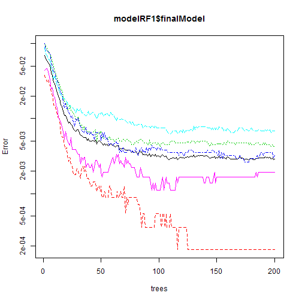
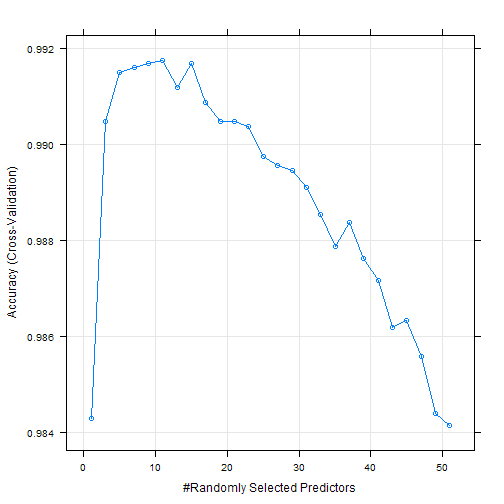
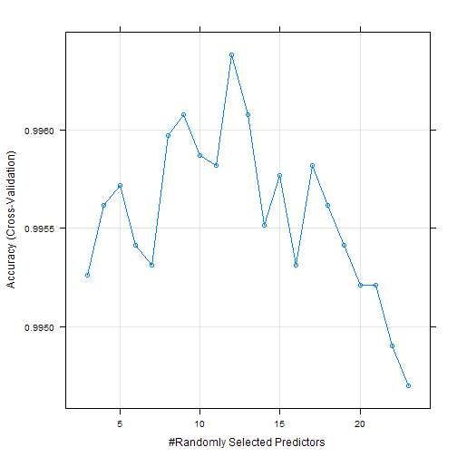

Practical Machine Learning Assignment
=====================================

## Introduction

In this project, the goal was to use data from accelerometers on the belt, forearm, arm, and dumbell
of 6 participants to predict the manner in which they did the exercise. 
They were asked to perform barbell lifts correctly and incorrectly in 5 different ways.

## Data


```r
train <- read.csv("pml-training.csv", na.strings = c("", "NA"), stringsAsFactors = F)
test <- read.csv("pml-testing.csv", , na.strings = c("", "NA"), stringsAsFactors = F)
train <- within(train, {classe <- factor(classe)})
```

The data was obtained from the [Human Activity Recognition](http://groupware.les.inf.puc-rio.br/har) 
reasearch by Groupware Technologies.
The training dataset containted 19622 observations with 160 variables.
The test dataset had 20 observations and the same number of variables.
The variable of interest was `classe`, which classified the manner the participants performed
the dumbbell bicep curl. It took on 5 values: A, B, C, D and E.

## Variable Cleaning

On reviewing the datasets, it was observed that many of the measurements 
had missing values for the majority of the obsersvations. 
A check revealed that measurements had the same number of missing values,
suggesting that the missing values originated from the same large number of observations.
Hence, it would not be appropriate to remove those observations.
Rather such variables would be removed since they would not be useful for prediction. 


```r
sumNA <- apply(sapply(train, is.na), 2, sum)
table(sumNA)
```

```
## sumNA
##     0 19216 
##    60   100
```

The first 7 variables contained information such as name of participants, time, etc.
which would not be useful and were also removed.


```r
names(train)[1:7]
```

```
## [1] "X"                    "user_name"            "raw_timestamp_part_1"
## [4] "raw_timestamp_part_2" "cvtd_timestamp"       "new_window"          
## [7] "num_window"
```


```r
train_sub <- subset(train, select = (sumNA == 0))[, -(1:7)]
test_sub <- subset(test, select = (sumNA == 0))[, -(1:7)]
```

The resulting datasets had 53 variables including the variable `classe`. 
The structure of the training dataset was shown below. The test dataset was similar.


```r
str(train_sub)
```

```
## 'data.frame':	19622 obs. of  53 variables:
##  $ roll_belt           : num  1.41 1.41 1.42 1.48 1.48 1.45 1.42 1.42 1.43 1.45 ...
##  $ pitch_belt          : num  8.07 8.07 8.07 8.05 8.07 8.06 8.09 8.13 8.16 8.17 ...
##  $ yaw_belt            : num  -94.4 -94.4 -94.4 -94.4 -94.4 -94.4 -94.4 -94.4 -94.4 -94.4 ...
##  $ total_accel_belt    : int  3 3 3 3 3 3 3 3 3 3 ...
##  $ gyros_belt_x        : num  0 0.02 0 0.02 0.02 0.02 0.02 0.02 0.02 0.03 ...
##  $ gyros_belt_y        : num  0 0 0 0 0.02 0 0 0 0 0 ...
##  $ gyros_belt_z        : num  -0.02 -0.02 -0.02 -0.03 -0.02 -0.02 -0.02 -0.02 -0.02 0 ...
##  $ accel_belt_x        : int  -21 -22 -20 -22 -21 -21 -22 -22 -20 -21 ...
##  $ accel_belt_y        : int  4 4 5 3 2 4 3 4 2 4 ...
##  $ accel_belt_z        : int  22 22 23 21 24 21 21 21 24 22 ...
##  $ magnet_belt_x       : int  -3 -7 -2 -6 -6 0 -4 -2 1 -3 ...
##  $ magnet_belt_y       : int  599 608 600 604 600 603 599 603 602 609 ...
##  $ magnet_belt_z       : int  -313 -311 -305 -310 -302 -312 -311 -313 -312 -308 ...
##  $ roll_arm            : num  -128 -128 -128 -128 -128 -128 -128 -128 -128 -128 ...
##  $ pitch_arm           : num  22.5 22.5 22.5 22.1 22.1 22 21.9 21.8 21.7 21.6 ...
##  $ yaw_arm             : num  -161 -161 -161 -161 -161 -161 -161 -161 -161 -161 ...
##  $ total_accel_arm     : int  34 34 34 34 34 34 34 34 34 34 ...
##  $ gyros_arm_x         : num  0 0.02 0.02 0.02 0 0.02 0 0.02 0.02 0.02 ...
##  $ gyros_arm_y         : num  0 -0.02 -0.02 -0.03 -0.03 -0.03 -0.03 -0.02 -0.03 -0.03 ...
##  $ gyros_arm_z         : num  -0.02 -0.02 -0.02 0.02 0 0 0 0 -0.02 -0.02 ...
##  $ accel_arm_x         : int  -288 -290 -289 -289 -289 -289 -289 -289 -288 -288 ...
##  $ accel_arm_y         : int  109 110 110 111 111 111 111 111 109 110 ...
##  $ accel_arm_z         : int  -123 -125 -126 -123 -123 -122 -125 -124 -122 -124 ...
##  $ magnet_arm_x        : int  -368 -369 -368 -372 -374 -369 -373 -372 -369 -376 ...
##  $ magnet_arm_y        : int  337 337 344 344 337 342 336 338 341 334 ...
##  $ magnet_arm_z        : int  516 513 513 512 506 513 509 510 518 516 ...
##  $ roll_dumbbell       : num  13.1 13.1 12.9 13.4 13.4 ...
##  $ pitch_dumbbell      : num  -70.5 -70.6 -70.3 -70.4 -70.4 ...
##  $ yaw_dumbbell        : num  -84.9 -84.7 -85.1 -84.9 -84.9 ...
##  $ total_accel_dumbbell: int  37 37 37 37 37 37 37 37 37 37 ...
##  $ gyros_dumbbell_x    : num  0 0 0 0 0 0 0 0 0 0 ...
##  $ gyros_dumbbell_y    : num  -0.02 -0.02 -0.02 -0.02 -0.02 -0.02 -0.02 -0.02 -0.02 -0.02 ...
##  $ gyros_dumbbell_z    : num  0 0 0 -0.02 0 0 0 0 0 0 ...
##  $ accel_dumbbell_x    : int  -234 -233 -232 -232 -233 -234 -232 -234 -232 -235 ...
##  $ accel_dumbbell_y    : int  47 47 46 48 48 48 47 46 47 48 ...
##  $ accel_dumbbell_z    : int  -271 -269 -270 -269 -270 -269 -270 -272 -269 -270 ...
##  $ magnet_dumbbell_x   : int  -559 -555 -561 -552 -554 -558 -551 -555 -549 -558 ...
##  $ magnet_dumbbell_y   : int  293 296 298 303 292 294 295 300 292 291 ...
##  $ magnet_dumbbell_z   : num  -65 -64 -63 -60 -68 -66 -70 -74 -65 -69 ...
##  $ roll_forearm        : num  28.4 28.3 28.3 28.1 28 27.9 27.9 27.8 27.7 27.7 ...
##  $ pitch_forearm       : num  -63.9 -63.9 -63.9 -63.9 -63.9 -63.9 -63.9 -63.8 -63.8 -63.8 ...
##  $ yaw_forearm         : num  -153 -153 -152 -152 -152 -152 -152 -152 -152 -152 ...
##  $ total_accel_forearm : int  36 36 36 36 36 36 36 36 36 36 ...
##  $ gyros_forearm_x     : num  0.03 0.02 0.03 0.02 0.02 0.02 0.02 0.02 0.03 0.02 ...
##  $ gyros_forearm_y     : num  0 0 -0.02 -0.02 0 -0.02 0 -0.02 0 0 ...
##  $ gyros_forearm_z     : num  -0.02 -0.02 0 0 -0.02 -0.03 -0.02 0 -0.02 -0.02 ...
##  $ accel_forearm_x     : int  192 192 196 189 189 193 195 193 193 190 ...
##  $ accel_forearm_y     : int  203 203 204 206 206 203 205 205 204 205 ...
##  $ accel_forearm_z     : int  -215 -216 -213 -214 -214 -215 -215 -213 -214 -215 ...
##  $ magnet_forearm_x    : int  -17 -18 -18 -16 -17 -9 -18 -9 -16 -22 ...
##  $ magnet_forearm_y    : num  654 661 658 658 655 660 659 660 653 656 ...
##  $ magnet_forearm_z    : num  476 473 469 469 473 478 470 474 476 473 ...
##  $ classe              : Factor w/ 5 levels "A","B","C","D",..: 1 1 1 1 1 1 1 1 1 1 ...
```

## Model Building

I chose to build the model using random forest due to its good performance. 
The tuning parameter for random forest was `mtry`,
which could take the values of integers up to the number of predictors in the dataset, 
in this case, it was 52.
Due to the large dataset, I faced the issue of a very time consuming model building process.
As a result, I broke down the model building to a few steps
to select the best tuning parameter and finalise the model.

The `doParallel` package was used to enable parallel computing, 
which would be extremely useful in speeding up the computation
since the `caret` package allowed the use of parallel computing by default.


```r
library(doParallel)
cl <- makeCluster(detectCores())
registerDoParallel(cl)
```

### Initial Model Selection

The first step was to go through the whole range of possible values of `mtry` over a coarse grid.
The range of values of `mtry` that produced models with performance above a threshold would 
then be used at the next stage over a finer grid. The initial grid was as followed.


```r
print(grid <- seq(1, 52, by = 2))
```

```
##  [1]  1  3  5  7  9 11 13 15 17 19 21 23 25 27 29 31 33 35 37 39 41 43 45
## [24] 47 49 51
```

As this would be an exploratoy stage, I used 2-fold cross validation to estimate the accuracy 
of the models, on which their performance was evaluated.
In addition, I set the number of trees to grow, `ntree`, to a smaller number of 200
to further reduce computation times.


```r
library(caret)
set.seed(1)
seeds <- c(replicate(2, sample.int(1000, length(grid)), simplify = F), sample.int(1000, 1))
modelRF1 <- train(classe ~ ., data = train_sub, method = "rf", ntree = 200,
                 trControl = trainControl(method = "cv", number = 2, seeds = seeds),
                 tuneGrid = data.frame(mtry = grid))
modelRF1$times$everything
plot(modelRF1$finalModel, log = "y")
```

```
##    user  system elapsed 
##   33.69    0.20  551.38
```



The above plot showed that the error rate was stable enough for `ntree` set to 200.


```r
plot(modelRF1)
gridrng <- with(modelRF1$results, range(mtry[Accuracy > 0.99]))
```



From the above plot, it could be observed the way the accuracy of the models varied 
as the tuning parameter was changed. The models with `mtry` in the range of (3, 23)
had accuracies above 99% and would be used for the next stage of model building.
The model performance deteriorated quickly beyond that range.
The grid of `mtry` for the next stage was shown below.


```r
print(grid <- gridrng[1]:gridrng[2])
```

```
##  [1]  3  4  5  6  7  8  9 10 11 12 13 14 15 16 17 18 19 20 21 22 23
```

### Final Model Selection

The final model selection was done using the finer grid of `mtry` selected in the previous step.
Since this step was used only to select the best value of the tuning parameter,
`ntree` was also set to 200 to reduce computation times.
However, I increased the number of folds of cross validation to 5 for better estimates of accuracy.


```r
set.seed(2)
seeds <- c(replicate(5, sample.int(1000, length(grid)), simplify = F), sample.int(1000, 1))
modelRF2 <- train(classe ~ ., data = train_sub, method = "rf", ntree = 200,
                  trControl = trainControl(method = "cv", number = 5, seeds = seeds),
                  tuneGrid = data.frame(mtry = grid))
modelRF2$times$everything
plot(modelRF2)
```

```
##    user  system elapsed 
##   34.50    0.45 1671.59
```




```r
print(best <- modelRF2$bestTune$mtry)
```

```
## [1] 12
```

The final selected `mtry` value was 12.

### Final Model

With the tuning parameter selected, it would be time to build the final model.
A 10-fold cross validation was used so that the out-of-sample error rate could be estimated.
`ntree` was left as the default value of 500.


```r
set.seed(3)
seeds <- as.list(sample.int(1000, 11))
modelRF3 <- train(classe ~ ., data = train_sub, method = "rf",
                  trControl = trainControl(method = "cv", seeds = seeds),
                  tuneGrid = data.frame(mtry = best))
modelRF3$finalModel
modelRF3$times$everything
print(results <- modelRF3$results)
```

```
## 
## Call:
##  randomForest(x = x, y = y, mtry = param$mtry) 
##                Type of random forest: classification
##                      Number of trees: 500
## No. of variables tried at each split: 12
## 
##         OOB estimate of  error rate: 0.27%
## Confusion matrix:
##      A    B    C    D    E class.error
## A 5577    2    0    0    1   0.0005376
## B   10 3783    4    0    0   0.0036871
## C    0    8 3412    2    0   0.0029223
## D    0    0   18 3196    2   0.0062189
## E    0    0    2    3 3602   0.0013862
```

```
##    user  system elapsed 
##   84.22    0.69  582.58
```

```
##   mtry Accuracy  Kappa AccuracySD  KappaSD
## 1   12   0.9968 0.9959   0.001922 0.002432
```

From the accuracy, the error rate was estimated to be **0.3211%**.
This would be an extremely good prediction performance.
The final model was then used to make prediction on the test dataset.
As an exercise, the models produced in the initial 2 steps were also used 
to make prediction to compare their outcomes.


```r
predRF1 <- predict(modelRF1, test_sub)
predRF2 <- predict(modelRF2, test_sub)
predRF3 <- predict(modelRF3, test_sub)
data.frame(predRF1, predRF2, predRF3)
```

```
##    predRF1 predRF2 predRF3
## 1        B       B       B
## 2        A       A       A
## 3        B       B       B
## 4        A       A       A
## 5        A       A       A
## 6        E       E       E
## 7        D       D       D
## 8        B       B       B
## 9        A       A       A
## 10       A       A       A
## 11       B       B       B
## 12       C       C       C
## 13       B       B       B
## 14       A       A       A
## 15       E       E       E
## 16       E       E       E
## 17       A       A       A
## 18       B       B       B
## 19       B       B       B
## 20       B       B       B
```

It turned out all 3 models produced the same predictions.
The prediction outcomes were then saved into separate files as instructed.


```r
pml_write_files = function(x){
    n = length(x)
    for(i in 1:n){
        filename = paste0("problem_id_",i,".txt")
        write.table(x[i],file=filename,quote=FALSE,row.names=FALSE,col.names=FALSE)
    }
}
if(!file.exists("predictions")) dir.create("predictions")
setwd("predictions")
pml_write_files(predRF3)
setwd("..")
stopCluster(cl)
```
