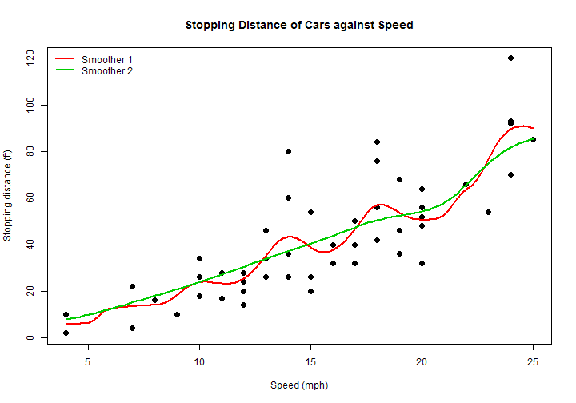

## Nadaraya-Watson Estimator

- The Nadaraya-Watson estimator is defined as follows:

$$
\hat{m}_h (x) = \frac{\sum \nolimits_{i=1}^n K_h (x-x_i) y_i}{\sum \nolimits_{i=1}^n K_h (x-x_i)}
$$

- It is essentially a weighted average of points in the neighbourhood with weights assigned by the kernel


- There are 2 tuning parameters: bandwidth, $h$, and kernel, $K(.)$

- These all appear quite complicated so how about learning what they do by 
tweaking those parameters and observe how they affect the estimator in a plot?

---

## Presenting my [Shiny app](https://yxtay.shinyapps.io/ddp-shiny/)



---

## Codes


```r
with(cars, {
    plot(speed, dist, pch = 20, cex = 2,
         main = "Stopping Distance of Cars against Speed",
         xlab = "Speed (mph)", ylab = "Stopping distance (ft)")
    lines(ksmooth(speed, dist, kernel = input$kern1, bandwidth = input$bw1), 
          col = 2, lwd = 2)
    lines(ksmooth(speed, dist, kernel = input$kern2, bandwidth = input$bw2), 
          col = 3, lwd = 2)
    legend("topleft", legend = c("Smoother 1", "Smoother 2"), col = 2:3, lwd = 2, bty = "n")
})
```

---

## Features

On the web app, you can:

- Tweak the bandwidth and kernel seperately

- See the changes in the NW estimator in real time

- Compare the estimators with 2 different tuning specifications

- Specify a given speed to get a prediction of stopping distance from the estimators


After using my app, hope you have:

- Learnt what the Nadaraya-Watson estimator is

- Learnt how it is controlled by the tuning parameters

- Realised that speeding is dangerous!
